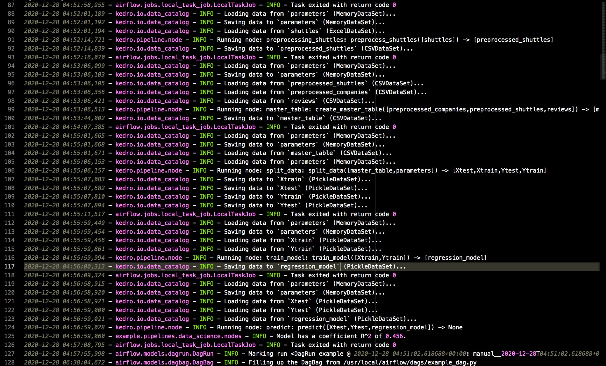
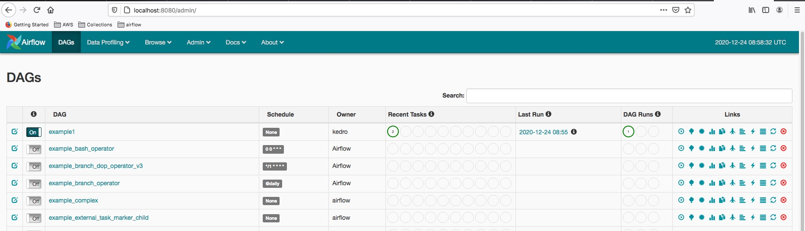
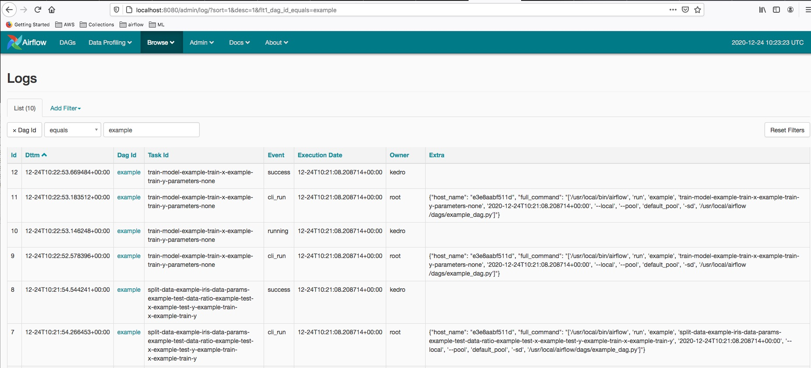

# Kedro Airflow Using Docker
    Create a kedro project and run kedro pipelines on Airflow platform
    Pre-process data, train model, evaluate and predict

### Prerequisites
+ Docker Compose
+ Airflow 1.10.9
+ Kedro 0.16.6
+ Kedro-Airflow 0.3.0
+ scikit-learn 0.23.0
+ pickle 0.0.11

### Workflows
+ Read data from csv files and excel file as well, pre-process files and then save csv files
+ Split data and then save pickle files
+ Read pickle files, run train model and also save the regression model(pickle format)
+ Load the regression model and run Predict from the pickle model

### Build
+ Build image
    ```
    ./scripts/build.sh
    ```

+ Run Airflow Webserver
    ```
    docker-compose up
    ```

+ Run Airflow Scheduler
    ```
    docker exec -it kedro-airflow-docker_webserver_1 bash
    airflow scheduler
    ```

+ Open web browser and click trigger dag
    ```
    http://localhost:8080
    ```

+ Open Visualise Pipelines
    ```
    docker exec -it kedro-airflow-docker_webserver_1 bash
    kedro viz --host 0.0.0.0
    ```
    Open the browser with http://localhost:4141

### Issues
+ [NOT Support for MemoryDataSet](https://github.com/quantumblacklabs/kedro-airflow/issues/41)
    ```
    {{api.py:296}} INFO - Loading: /usr/local/airflow/example/conf/base/logging.yml
    /usr/local/lib/python3.7/site-packages/fsspec/implementations/local.py:33: FutureWarning: The default value of auto_mkdir=True has been deprecated and will be changed to auto_mkdir=False by default in a future release.
    FutureWarning,
    2020-12-23 03:17:14,387 - airflow.models.dagbag.DagBag - ERROR - Failed to import: /usr/local/airflow/dags/example_dag.py
    Traceback (most recent call last):
    File "/usr/local/lib/python3.7/site-packages/airflow/models/dagbag.py", line 243, in process_file
        m = imp.load_source(mod_name, filepath)
    File "/usr/local/lib/python3.7/imp.py", line 171, in load_source
        module = _load(spec)
    File "<frozen importlib._bootstrap>", line 696, in _load
    File "<frozen importlib._bootstrap>", line 677, in _load_unlocked
    File "<frozen importlib._bootstrap_external>", line 728, in exec_module
    File "<frozen importlib._bootstrap>", line 219, in _call_with_frames_removed
    File "/usr/local/airflow/dags/example_dag.py", line 95, in <module>
        runner.run(pipeline, data_catalog)
    File "/usr/local/lib/python3.7/site-packages/kedro_airflow/runner.py", line 115, in run
        catalog.add(ds_name, self.create_default_data_set(ds_name))
    File "/usr/local/lib/python3.7/site-packages/kedro_airflow/runner.py", line 90, in create_default_data_set
        "AirflowRunner does not support unregistered data sets.".format(ds_name)
    ValueError: Data set 'example_train_y' is not registered in the data catalog.
    AirflowRunner does not support unregistered data sets.

    ```
    Fixed: define output data files for each node in catalog.yml(save output files for each node)

+ [Could not load Excel Data Set](https://exerror.com/xlrd-biffh-xlrderror-excel-xlsx-file-not-supported/)
    ```
    kedro.io.core.DataSetError: Failed while loading data from data set ExcelDataSet
    (filepath=/home/kedro/data/01_raw/shuttles.xlsx,
    load_args={'engine': xlrd}, protocol=file, save_args={'index': False},
    writer_args={'engine': xlsxwriter}).
    Excel xlsx file; not supported
    ```
    Fixed: xlrd==1.2.0


### Results
+ Kedro Visualise Pipelines


+ Kedro Logs


+ Airflow Dashboard


+ Airflow Logs


### Reference
+ [Create a Pipeline](https://kedro.readthedocs.io/en/0.16.6/03_tutorial/04_create_pipelines.html)
+ [Kedro Airflow Test](https://github.com/evanmiller29/kedro-airflow-test)
